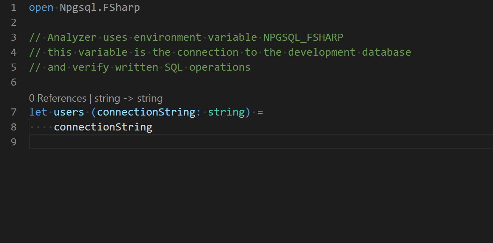

# Npgsql.FSharp.Analyzer

Analyzer that provides embedded **SQL syntax analysis** when writing queries using [Npgsql.FSharp](https://github.com/Zaid-Ajaj/Npgsql.FSharp). It verifies query syntax, checks the parameters in the query match with the provided parameters and performs **type-checking** on the functions that read columns from the result sets.

]

## Features
- Static query syntax analysis and type-checking against development database
- Detecting missing or redundant parameters
- Detecting parameters with type-mismatch
- Verifying the columns being read from the result set and their types
- Detecting nullable columns
- Built-in code fixes for most of the above
- Free

## NuGet

Package | Stable | Prerelease
--- | --- | ---
NpgsqlFSharpAnalyzer | [](https://www.nuget.org/packages/NpgsqlFSharpAnalyzer/) | [](https://www.nuget.org/packages/NpgsqlFSharpAnalyzer/)


## Using The Analyzer

### 1 - Set `NPGSQL_FSHARP` environment variable
The analyzer requires an environment variable named `NPGSQL_FSHARP` with a connection string that points to your development database. The analyzers uses this connection string to retrieve the schema of the database as well as the schema and column output of the result sets from the various queries.

### 2 - Install the analyzer using paket
Use paket to install the analyzer into a specialized `Analyzers` dependency group like this:
```
paket add NpgsqlFSharpAnalyzer --group Analyzers
```
**DO NOT** use `storage:none` because we want the analyzer package to be downloaded physically into `packages/analyzers` directory.

### 3 - Enable analyzers in Ionide
Make sure you have these settings in Ionide for FSharp
```json
{
    "FSharp.enableAnalyzers": true,
    "FSharp.analyzersPath": [
        "./packages/analyzers"
    ]
}
```
Which instructs Ionide to load the analyzers from the directory of the analyzers into which `NpgsqlFSharpAnalyzer` was installed.

### Writing Long Multi-line Queries

When it is not convenient to write a query inline like this:
```fs
Sql.query "HERE COMES A VERY LONG QUERY"
```
You can define the query as a *module-level* `[<Literal>]` string and use it from the `Sql.query` function like this:
```fs
let [<Literal>] selectActiveUsers = """
    SELECT * FROM users
    WHERE is_active = @is_active
"""

let activeUsers (connectionString: string) =
    connectionString
    |> Sql.connect
    |> Sql.query selectActiveUsers
    |> Sql.parameters [ "is_active", Sql.Value true ]
    |> Sql.executeReader (Sql.readRow >> Sql.readString "username")
```
The `[<Literal>]` string has to be defined in the same module in order for the analysis to run properly.

Better yet, if you use the [FSharp.Data.LiteralProviders](https://github.com/Tarmil/FSharp.Data.LiteralProviders) package, you can write your SQL queries in external SQL files and load them in compile-time as a `[<Literal>]` string to allow for the analyzer to pick it up:
```fs
let [<Literal>] selectActiveUsers = TextFile<"selectActiveUsers.sql">.Text

let activeUsers (connectionString: string) =
    connectionString
    |> Sql.connect
    |> Sql.query selectActiveUsers
    |> Sql.parameters [ "is_active", Sql.Value true ]
    |> Sql.executeReader (Sql.readRow >> Sql.readString "username")
```
Just remember that these `[<Literal>]` strings have to defined in the same module where the query is written.


---

### Developing

Make sure the following **requirements** are installed on your system:

- [dotnet SDK](https://www.microsoft.com/net/download/core) 3.0 or higher
- [Mono](http://www.mono-project.com/) if you're on Linux or macOS.
- Postgres database server

or

- [VSCode Dev Container](https://code.visualstudio.com/docs/remote/containers)

---

### Building


```sh
> build.cmd <optional buildtarget> // on windows
$ ./build.sh  <optional buildtarget>// on unix
```

### Running The Tests

The tests create and dispose a test database dynamically so you don't need to setup anything. This database is created using a default connection string that connects to your local Postgres server like this:
```fs
let createTestDatabase() =
    Sql.host "localhost"
    |> Sql.port 5432
    |> Sql.username "postgres"
    |> Sql.password "postgres"
    |> Sql.str
    |> ThrowawayDatabase.Create
```
Make sure you have a user with username and password called `postgres`.

---

### Build Targets

- `Clean` - Cleans artifact and temp directories.
- `DotnetRestore` - Runs [dotnet restore](https://docs.microsoft.com/en-us/dotnet/core/tools/dotnet-restore?tabs=netcore2x) on the [solution file](https://docs.microsoft.com/en-us/visualstudio/extensibility/internals/solution-dot-sln-file?view=vs-2019).
- [`DotnetBuild`](#Building) - Runs [dotnet build](https://docs.microsoft.com/en-us/dotnet/core/tools/dotnet-build?tabs=netcore2x) on the [solution file](https://docs.microsoft.com/en-us/visualstudio/extensibility/internals/solution-dot-sln-file?view=vs-2019).
- `DotnetTest` - Runs [dotnet test](https://docs.microsoft.com/en-us/dotnet/core/tools/dotnet-test?tabs=netcore21) on the [solution file](https://docs.microsoft.com/en-us/visualstudio/extensibility/internals/solution-dot-sln-file?view=vs-2019).
- `GenerateCoverageReport` - Code coverage is run during `DotnetTest` and this generates a report via [ReportGenerator](https://github.com/danielpalme/ReportGenerator).
- `WatchTests` - Runs [dotnet watch](https://docs.microsoft.com/en-us/aspnet/core/tutorials/dotnet-watch?view=aspnetcore-3.0) with the test projects. Useful for rapid feedback loops.
- `GenerateAssemblyInfo` - Generates [AssemblyInfo](https://docs.microsoft.com/en-us/dotnet/api/microsoft.visualbasic.applicationservices.assemblyinfo?view=netframework-4.8) for libraries.
- `DotnetPack` - Runs [dotnet pack](https://docs.microsoft.com/en-us/dotnet/core/tools/dotnet-pack). This includes running [Source Link](https://github.com/dotnet/sourcelink).
- `PublishToNuGet` - Publishes the NuGet packages generated in `DotnetPack` to NuGet via [paket push](https://fsprojects.github.io/Paket/paket-push.html).
- `BuildDocs` - Generates Documentation from `docsSrc` and the [XML Documentation Comments](https://docs.microsoft.com/en-us/dotnet/csharp/programming-guide/xmldoc/) from your libraries in `src`.
- `WatchDocs` - Generates documentation and starts a webserver locally.  It will rebuild and hot reload if it detects any changes made to `docsSrc` files, libraries in `src`, or the `docsTool` itself.
- `ReleaseDocs` - Will stage, commit, and push docs generated in the `BuildDocs` target.
---
